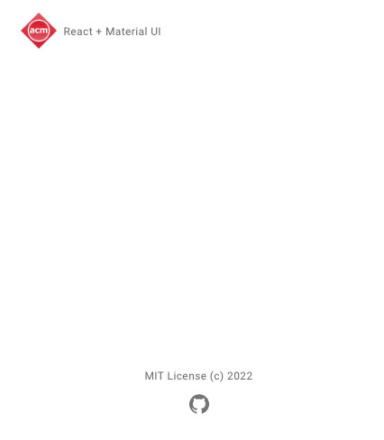

> **Part 1 - React + MUI template**
+ [Part 2 - useState and useContext hooks](https://github.com/rosealexander/react-mui-workshop/tree/part2-useContext%26useState)
+ [part 3 - fetch API and useEffect hook](https://github.com/rosealexander/react-mui-workshop/tree/part3-useEffect)
+ [part 4 - MUI component library](https://github.com/rosealexander/react-mui-workshop/tree/part4-MUI)
___

### Create React App
This project was bootstrapped with [Create React App](https://create-react-app.dev/docs/getting-started), an opinionated 
toolkit for creating react applications that's bundled with features including a local development server, 
testing framework, preconfigured webpack and buildscripts and much more. To keep things simple, the testing framework 
has been removed.

### Available Scripts
In the **project root directory**, you can run:

#### `npm install`
This is a npm command that installs all dependencies for this project that are listed in package.json.

#### `npm start`
This command has been added and configured for us by Create React App and will launch our app in development mode.\

#### `npm run build`
This command has also been provided to us by Create React App and will compile all of our .jsx into regular javascript 
and create a folder `build` that has all the files needed to run in a web browser.
___
### Local dev environment
- Go ahead and run `npm install` and then `npm start`.
- Open [http://localhost:3000](http://localhost:3000) to view your React app in the browser.
  The page will reload if you make edits, and you will also see any lint errors in the console.

You should see your awesome React app loaded in the browser, which is just going to be a blank white screen at the 
moment. Keep this window open as we make edits in the following steps.

###  Project layout
Here is what our current project layout looks like:
* [/public ⧉](https://create-react-app.dev/docs/using-the-public-folder/)
  * acm_logo.png
  * favicon.ico
  * index.html
* /src
  * App.js
  * /features
    * Body.jsx
    * Footer.jsx
    * Header.jsx
    * Layout.jsx
    * /theme
      * theme.js
  * index.js
  
- `/public` contains HTML and can also hold images and files
- `/public/index.html` the page template.
- `/src` where we will keep all of our source code.
- `/src/app.js` a component that acts as a container for all other components.
- `/src/features` directory to keep all our UI features
- `/src/features/Layout.jsx` a container component wrapping our Header, Footer and Body components.
- `/src/features/theme/theme.js` outlines the color scheme used in the MUI component library.
- `/src/index.js` is the JavaScript entry point and contains the logic for rendering the **App** component.

### App.js
[Material UI](https://mui.com) (MUI) is a React component library styled using the
[Material Design UI framework](https://material.io/design/introduction). 
MUI is configured in `App.js` by wrapping all
other components within a `<ThemeProvider />` component. We are going to use a custom theme by importing and passing 
**lightTheme** to the ThemeProvider's **theme** prop.

Replace App.js with the following:
```jsx
// App.js
import Layout from "./features/Layout";
import {ThemeProvider} from "@mui/material/styles";
import CssBaseline from "@mui/material/CssBaseline";
import lightTheme from "./features/theme/theme";

function App() {
    return (
            <ThemeProvider theme={lightTheme}>
                <CssBaseline />
                <Layout />
            </ThemeProvider>
    );
}

export default App;
```
- `<CssBaseline />`
is a component provided by MUI that normalizes css styling across devices and browsers. 
[https://mui.com/material-ui/react-css-baseline/](https://mui.com/material-ui/react-css-baseline/)
- `<Layout />` is a component that created and are going to use to structure our web apps page layout.
___
### Theme.js
Take a look at `/src/features/theme/theme.js`. When we added `lightTheme` earlier to `<ThemeProvider/>`, it was 
exported from `theme.js`. **lightTheme*** is a custom theme that we have defined by using MUI's `createTheme()`.
```jsx
// theme.js
import {createTheme, responsiveFontSizes} from "@mui/material";

export const lightTheme = responsiveFontSizes(
        createTheme({
...
```
- `createTheme` allows us to define a custom theme that we can provide to **ThemeProvider** like we did earlier. \
[https://mui.com/material-ui/customization/theming/](https://mui.com/material-ui/customization/theming/)
- `responsiveFontSizes` makes it so that our theme will scale font size based on browser window size. \
[https://mui.com/material-ui/customization/typography/#responsive-font-sizes](https://mui.com/material-ui/customization/typography/#responsive-font-sizes)
___
### Layout.jsx
We will cover MUI more in depth in [part&nbsp;4](https://github.com/rosealexander/react-mui-workshop/tree/part4-MUI)
but for now, lets replace Layout.jsx with the following and see what it does. 
```jsx
// Layout.jsx
import Header from './Header';
import Body from './Body'
import Footer from "./Footer";
import {Box, Container} from "@mui/material";

const Layout = () => {
    return (
        <Container
            maxWidth='xs'
        >
            <Box
                display='flex'
                flexDirection='column'
                justifyContent='space-between'
                height='100vh'
                py={2}
            >
                <Header/>
                <Body />
                <Footer/>
            </Box>
        </Container>
    )
}
export default Layout
```
Now we can finally see something in our local dev environment.
- `<Container />` is a core MUI component type that we can wrap around other components, in this case we are wrapping it 
around everything inside the **Layout** component. Passing **xs** into the **maxWidth** prop restricts the component 
width within the **xs** breakpoint defined in our custom theme.
```js
// theme.js
export const lightTheme = responsiveFontSizes(
...
breakpoints: {
    values: {
        xs: 0,
        sm: 600,
        md: 900,
        lg: 1200,
        xl: 1536,
    },
},
```
- The `Header` and `Footer` components have already been defined for us so don't worry about these too much right now 
and `Body` is just serving as a placeholder that we will revisit later during 
[part&nbsp;4](https://github.com/rosealexander/react-mui-workshop/tree/part4-MUI).

You should be seeing this at [http://localhost:3000](http://localhost:3000): \


> [Part 2 - useState and useContext hooks](https://github.com/rosealexander/react-mui-workshop/tree/part2-useContext%26useState)
___
