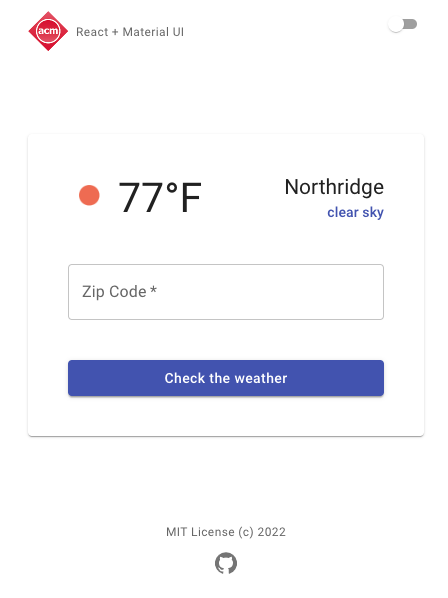

# Part 4 - Material UI (MUI)
___
+ [Part 1 - React + MUI template](https://github.com/rosealexander/react-mui-workshop/tree/part1)
+ [Part 2 - useContext and useState hooks](https://github.com/rosealexander/react-mui-workshop/tree/part2)
+ [part 3 - fetch API and useEffect hook](https://github.com/rosealexander/react-mui-workshop/tree/part3)
> **part 4 - MUI component library**
___
The [MUI component library]() allows us to use many styled components right out of the box. Using a component library 
like **MUI** is a great way to jumpstart any React front-end. The core features of MUI include **inputs**, 
**data display**, **feedback**, **surfaces**, **navigation**, **layout**, and **utilities**. We will only be using some 
of these features for our project, but it's good to know that MUI is able to provide many necessary components for 
building even more complex UI. 

We have already used some **MUI components**. Lets take another look in **Layout.jsx**.
```jsx
const Layout = () => {
    return (
        <Container
            maxWidth='xs'
        >
            <Box
                display='flex'
                flexDirection='column'
                justifyContent='space-between'
                height='100vh'
                py={2}
            >
                <Header/>
                <Body />
                <Footer/>
            </Box>
        </Container>
    )
}
```
### [Container](https://mui.com/material-ui/api/container/)
The **Container** centers content horizontally and is one of MUI's most basic layout elements.
- `maxWidth='xs'` Limits everything wrapped within the **Container** component to have a max width of whatever we have 
set as our **xs** breakpoint. In this case, **xs** is anything less than 600px.
  - [MUI default breakpoints](https://developer.mozilla.org/en-US/docs/Web/CSS/CSS_Flexible_Box_Layout/Basic_Concepts_of_Flexbox)
### [Box](https://mui.com/material-ui/react-box/)
The Box component is a layout component that serves as a wrapper that allows us to add css affecting wrapped components.
- `display='flex'` Changes display behavior to be 'flex'.
  - [Basic Concepts of Flexbox](https://developer.mozilla.org/en-US/docs/Web/CSS/CSS_Flexible_Box_Layout/Basic_Concepts_of_Flexbox)
- `flexDirection='column'`Elements will be aligned vertically.
- `justifyContent='space-between'` Each element will have equal space between eachother.
- `height='100vh'` This box wrapper height will be the entire screen height.
- `py={2}` Adds some padding to top, right, bottom and left sides of the **Box** component.


Now let's open up **Body.jsx** and add the following to the **Body** component. 
```jsx
// Body.jsx
import {Grid, Paper} from "@mui/material";
import WeatherForm from "./WeatherForm";
import WeatherDisplay from "./WeatherDisplay";
...
const Body = memo(() => {
...
    return (
        <Paper sx={{p:5}}>
            <Grid
                container
                direction='column'
                spacing={5}
            >
                <Grid item>
                    <WeatherDisplay
                        weatherData={weatherData}
                    />
                </Grid>
                <Grid item>
                    <WeatherForm
                        setWeatherData={setWeatherData}
                        fetchWeather={fetchWeather}
                    />
                </Grid>
            </Grid>
        </Paper>
    );
});
...
```

### [Paper](https://mui.com/material-ui/api/paper/)
**Paper** is a surface component that wraps other components inside, giving them a flat, opaque background with a raised 
edge.
- `sx={{p:5}}` The [**sx**](https://mui.com/system/the-sx-prop/) prop isn't specific to **Paper** and can be used with 
any **MUI** component to define custom styling. Here he are adding extra padding to the **Paper** component.
### [Grid](https://mui.com/material-ui/api/grid/)
**Grid** is a layout component responsive that "adapts to screen size and orientation, ensuring consistency across 
layouts". We can use it to organize visual components in predictable ways across devices and screen sizes.
- `container` implying that there will be other nested **Grid** components tagged as items
- `direction='column'` items will align vertically
- `spacing={5}` spacing between items
- `item` designating this **Grid** component as an item belonging to a parent **Grid** component tagged as **container**
  - Grid items cannot be both **items** and **containers** 
  
Next, open WeatherForm.jsx and replace with the following:
```jsx
// WeatherForm.jsx
import {useState} from 'react';
import {Button, Grid, TextField} from "@mui/material";

const WeatherForm = ({setWeatherData, fetchWeather}) => {
    const [zipCode, setZipCode] = useState('')

    const handleSubmit = (event) => {
        event.preventDefault()
        fetchWeather(zipCode).then(data => setWeatherData(data))
    }

    return (
        <form
            onSubmit={handleSubmit}
        >
            <Grid
                container
                direction='column'
                spacing={5}
            >
                <Grid item>
                    <TextField
                        required
                        fullWidth
                        id="item-name-input"
                        aria-describedby="my-helper-text"
                        value={zipCode}
                        onChange={event => setZipCode(event.target.value)}
                        autoComplete='off'
                        inputProps={{ maxLength: 5 }}
                        label='Zip Code'
                    />
                </Grid>
                <Grid item>
                    <Button
                        fullWidth
                        type='submit'
                        variant='contained'
                    >
                        Check the weather
                    </Button>
                </Grid>
            </Grid>
        </form>
    );
};

export default WeatherForm;
```

### [TextField](https://mui.com/material-ui/api/text-field/)
**TextFields** is an input component that lets users edit and enter text.
- `required` If TextField is wrapped within `<form>` we are indicating that it is a required field.
- `fullWidth` Extends the width to be 100% of its parent component.
- `value={zipCode}` The value that will display in this text field
- `onChange={event => setZipCode(event.target.value)}` A callback to occur whenever **TextField** input is changed
- `autoComplete='off'` disables browser autocomplete
- `inputProps={{ maxLength: 5 }}` limits the number of characters allowed
- `label='Zip Code'` The **TextField** label that gets displayed

### [Button](https://mui.com/material-ui/api/button/)
**Button** is an input component that allows users to take action by clicking on it.
- `type='submit'` Because we are wrapping this button inside of `form`, we indicate that clicking it will submit it.
- `variant='contained'` Styles the button to look a certain way, there are three options that all change the appearence
of the **Button** and they are 'contained,' 'outlined' and 'text'.

Open up WeatherDisplay.jsx and replace with this:
```jsx
// WeatherDisplay.jsx
import {Avatar, Grid, Typography} from "@mui/material";

const WeatherDisplay = ({weatherData = {}}) => {
    if (!weatherData?.weather) return null

    const name = weatherData.name
    const temp = parseInt(weatherData.main.temp)
    const description = weatherData.weather[0].description
    const icon = `https://openweathermap.org/img/wn/${weatherData.weather[0].icon}@2x.png`

    return (
        <Grid
            container
            justifyContent='space-between'
        >
            <Grid item>
                <Grid
                    container
                    spacing={1}
                >
                    <Grid item>
                        <Avatar
                            sx={{ width: 42, height: 42 }}
                            src={icon}
                        />
                    </Grid>
                    <Grid item>
                        <Typography
                            align='right'
                            variant='h3'
                        >
                            {temp}°F
                        </Typography>
                    </Grid>
                </Grid>
            </Grid>
            <Grid item>
                <Grid
                    container
                    direction='column'
                >
                    <Grid item>
                        <Typography
                            align='right'
                            variant='h5'
                        >
                            {name}
                        </Typography>
                    </Grid>
                    <Grid item>
                        <Typography
                            align='right'
                            variant='subtitle2'
                            color='primary'
                        >
                            {description}
                        </Typography>
                    </Grid>
                </Grid>
            </Grid>
        </Grid>
    );
};

export default WeatherDisplay;
```
### [Avatar](https://mui.com/material-ui/api/avatar/)
**Avatar** is a data display component that are basically little circles that you can place text or images inside.
- `src={icon}` Open weather actually gives us an image representing the current weather condition at the requested area code so we
  are displaying it in this component.

### [Typography](https://mui.com/material-ui/api/typography/)
**Typography** is a data display component used for styling text.
- `align='right'` The direction to align text wrapped inside the **Typography** component.
- `variant='h3'` The font weight and size of this text. 
  - [Typography variant prop information.](https://mui.com/material-ui/react-typography/#component)
- `color='primary'` The color of this text, based on our theme.

These are just some many MUI components available to us, reference to many more can be found in the 
[MUI component documentation](https://mui.com/material-ui/getting-started/supported-components/).

At this point your app should look like this... \


That is it for this workshop! If you are looking to an easy-to-use template to jumpstart your React + MUI projects
feel free to clone my [**react-mui-boilerplate**](https://github.com/rosealexander/react-mui-boilerplate) repo. 

### Learn More
- You can learn more about React and Material UI from the [React documentation](https://reactjs.org/)
  and [MUI v5 documentation](https://mui.com/getting-started/installation/).
- To learn more about Material Design take a look at [material.io](https://material.io/design).
- For everything you need to know about Git, take a look at this [Git Guide](https://github.com/git-guides).
___
